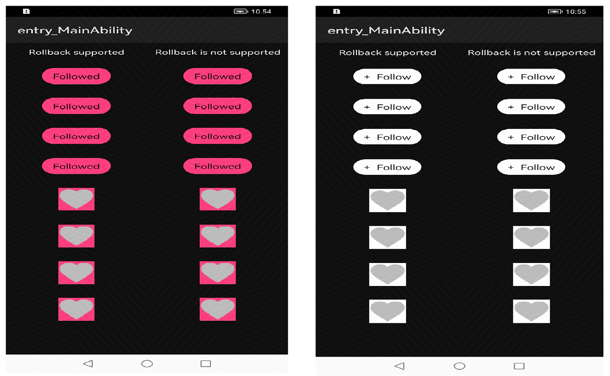

# RevealLayout

## Introduction

Reveal the effect layout, you can specify 2 sub-layouts, and switch the selected state with the circular reveal effect.

## Source

The code in this repository was inspired from [goweii/RevealLayout - v1.3.4](https://github.com/goweii/RevealLayout). 
We are very thankful to goweii Goweii and mbacuiz.

## Screenshot


&nbsp;&nbsp;&nbsp;&nbsp;&nbsp;&nbsp;&nbsp;&nbsp;&nbsp;&nbsp;&nbsp;&nbsp;&nbsp;&nbsp;&nbsp;&nbsp;

## Integration method

##Add dependency

In order to use the library, add the following line to your **root** gradle file:


1. Add dependency in build.gradle of project app directory
Starting from version 4.13.1, v is not added before the version number, and you need to pay attention to it when 
quoting.
```
    dependencies {
        implementation fileTree(dir: 'libs', include: ['*.jar', '*.har'])
        testImplementation 'junit:junit:4.13.1'
        ohosTestImplementation 'com.huawei.ohos.testkit:runner:1.0.0.200'
        implementation project(':reveallayout')
    }
```
2. For using RevealLayout from a remote repository in separate application, add the below dependencies in 
entry/build.gradle file.
```
    dependencies {
        implementation fileTree(dir: 'libs', include: ['*.jar'])
        testImplementation 'junit:junit:4.13.1'
        ohosTestImplementation 'com.huawei.ohos.testkit:runner:1.0.0.200'
    }
``` 

## Usage

To use RevealLayout in your app simply follow below simple steps:

#### Layout file reference

<per.goweii.reveallayout.RevealLayout
                ohos:id="$+id:reveal_layout"
                ohos:width="match_content"
                ohos:height="match_content"
                ohos:padding="15vp"
                app:rl_allowRevert="false"
                app:rl_animDuration="1000"
                app:rl_checkWithExpand="true"
                app:rl_checked="false"
                app:rl_checkedLayout="$layout:reveal_layout_follow_checked"
                app:rl_uncheckWithExpand="true"
                app:rl_uncheckedLayout="$layout:reveal_layout_follow_unchecked" />

#### Set up monitoring in the code

#### Custom subclass

For example, a follow and unfollow control FollowView only needs to inherit RevealLayout, and then copy the following 
3 methods:

initAttr(AttributeSet attrs): Get the custom attributes of the subclass
createCheckedView(): Create a selected state view and initialize custom properties
createUncheckedView(): Create an unchecked view and initialize custom attributes

####initAttr()

public class RevealLayout extends StackLayout implements Checkable, ValueUpdateListener, Animator.StateChangedListener,
        Component.TouchEventListener {
    private Component mCheckedView;
    private Component mUncheckedView;
    private int mCheckedLayoutId = 0;
    private int mUncheckedLayoutId = 0;
    private int mAnimDuration = 500;
    private boolean mCheckWithExpand = true;
    private boolean mUncheckWithExpand = false;
    private boolean mAllowRevert = false;
    private boolean mHideBackView = true;
    private boolean mChecked = false;
    private float mCenterX = 0F;
    private float mCenterY = 0F;
    private float mRevealRadius = 0F;
    private float mStart = 0F;
    private float mEnd = 0F;
    private final Path mPath = new Path();
    private AnimatorValue mAnimator;
    private static final String VIEW_CHECKED = "rl_checkedLayout";
    private static final String VIEW_UNCHECKED = "rl_uncheckedLayout";

    public RevealLayout(Context context) {
        this(context, null);
        setTouchEventListener(this);
    }

    public RevealLayout(Context context, AttrSet attrs) {
        this(context, attrs, 0);
        setTouchEventListener(this);
    }

    public RevealLayout(Context context, AttrSet attrs, int defStyleAttr) {
        super(context, attrs);
        initAttr(attrs);
        initView(context);
        setTouchEventListener(this);
        setClickedListener(this);

    }

####createCheckedView()

protected Component createCheckedView(Context context) {
        Component checkedView;
        if (mCheckedLayoutId > 0) {
            System.out.println("entry into createcheckedview2 " + mCheckedLayoutId);
            checkedView = LayoutScatter.getInstance(getContext()).parse(mCheckedLayoutId, null, false);
        } else {
            checkedView = new Component(getContext());
        }
        return checkedView;
    }

####createUncheckedView

protected Component createUncheckedView(Context context) {
        Component uncheckedView;
        if (mUncheckedLayoutId > 0) {
            uncheckedView = LayoutScatter.getInstance(getContext()).parse(mUncheckedLayoutId, this,
                    false);
        } else {
            uncheckedView = new Component(getContext());
        }
        return uncheckedView;
    }
